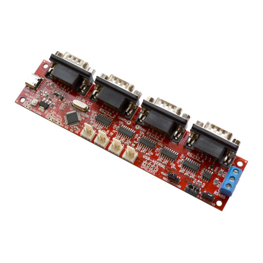
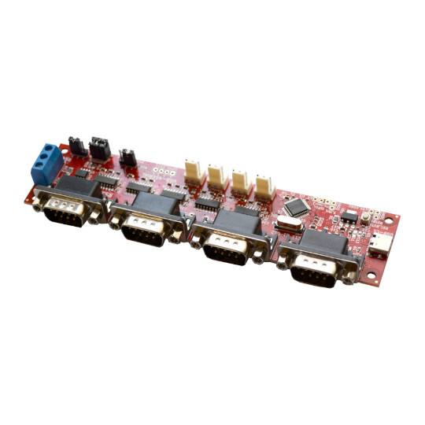
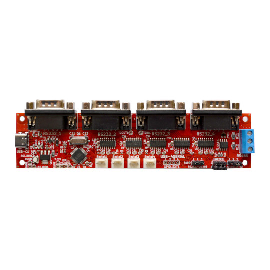
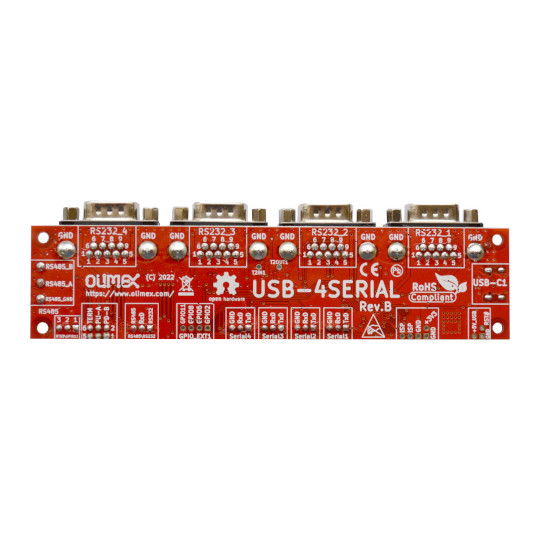

# USB-4SERIAL

USB-4SERIAL is Open Source Harrdware USB 2.0 High Speed to four RS232 levels or 3.3V TTL levels serial UARTs and one shared RS485 current loop serial port

## Features
* USB-C High Speed USB 2.0 connector for powering the board and communication
* The serial ports can be with baud rate up to 12Mbps on the TTL connector and up to 115200 bpx on RS232 levels connectors.
* The serial ports are compatible with 16C550 UART and support 5, 6, 7 or 8 data bits and 1 or 2 stop bits, odd, even, none, blank0, mark1 and other parity.
* Supports RTS and CTS hardware automatic flow control for the First one RS232 Serial port.
* Supports half-duplex and RS485 switching for the Fourth port.
* RS485 direction flow selectable by RTS3 or GPIO11
* Reset button
* High reliable industrial grade design -40+85C
* CE-RED and LVD certification
* Four mount holes 3 mm
* PCB dimensions: (150 x 35)mm ~ (5.9 x 1.38)"

Product page: https://www.olimex.com/Products/USB-Modules/USB-4SERIAL/open-source-hardware

## Licensee
* Hardware is released under CERN Open Hardware Licence Version 2 - Strongly Reciprocal, all silkscreen credits to Olimex should remain;
* Software is released under GPL3 Licensee
* Documentation is released under CC BY-SA 3.0

